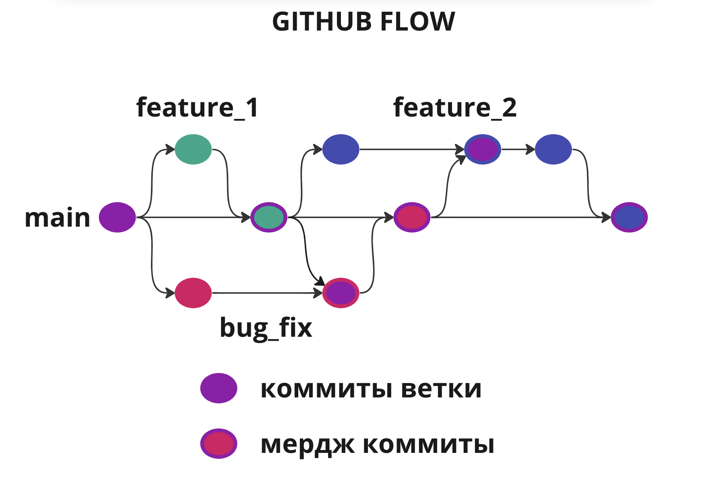

# Github Flow
GitHub Flow - это методология разработки ПО, которая сочетает в себе лучшие практики из Git и GitHub. Она предлагает простой и понятный процесс для разработки ПО, который позволяет команде быстро и эффективно создавать новые функции, исправлять ошибки и выпускать новые версии.

Пример гита при работе по github flow
## Почему github flow
1. Эффективная командная работа. GitHub Flow работает лучше всего для команд разработчиков, которые работают над одним проектом. Все операции выполняются на базе главной ветки, что облегчает интеграцию изменений, уменьшает фрагментацию ветвления и улучшает командную работу.
2. Простота использования. GitHub Flow очень прост в использовании, что позволяет команде быстро начать работу над проектом. Множество инструментов и функций GitHub помогают быстро создавать новые функции, исправлять ошибки и выпускать новые версии.
3. Надежность. GitHub Flow был разработан компанией GitHub и опробован на практике в течение многих лет. Это обеспечивает надежность и устойчивость работы методологии, а также поддержку и принятие сообществом разработчиков.
4. Непрерывная интеграция и развертывание. GitHub Flow легко интегрируется с инструментами непрерывной интеграции и развертывания, такими как Travis CI и Heroku. Это позволяет командам быстро и безопасно выпускать новые версии приложений.
5. Открытость. GitHub Flow использует открытый и прозрачный процесс разработки, что позволяет командам легко отслеживать изменения, проводить код-ревью и делать предложения по улучшению проекта.

## Базовые принципы
### Создание коммитов
- Один коммит - одна фича
- Заголовок коммита должен отображать изменения в коде
- Заголовок коммита должен быть лаконичным
- Для более подробного описания можно использовать блок описания коммита

### Работа с ветками
- Одна ветка - одна задача
- Не меняем главную ветку напрямую, все изменения через пулл реквесты
- Имя ветки отражает суть задачи или ее номер в системе
- Прежде чем пушить изменения надо обновить main и влить в свою ветку

## Работа с гитом в процессе решения задачи
1. `git checkout -b yourBranchName`
2. Пишем код, который решает задачу
3. Коммитим все свои изменения
4. `git checkout main`
5. `git pull`
6. Возвращаемся в свою ветку `git checkout yourBranchName`
7. `git merge main`
8. Решаем конфликты, если они есть
9. Пушим в репозиторий `git push --set-upstream origin yourBranchName`
10. Создаем пул реквест

## Базовые команды

### Работа с коммитами и удаленным репозиторием

- `git add fileNames` - добавляет файлы для коммита
- `git comit -m 'message'` - коммит добавленные файлы с сообщением
- `git fetch` - запрашивает информацию о ветках с удаленного репозитория
- `git push` - отправляет данные на удаленный репозиторий
- `git pull` - получает данные с удаленного репозитория

### Работа с ветками

- `git checkout name` - переключамся на существующую ветку
- `git checkout -b name` - создаем новую ветку и переключаемся на нее
- `git branch` - получаем список доступных веток
- `git merge name` - запускает процесс слияния двух веток
- `git merge --continue` - продолжает процесс слияния после разрешения мердж конфликтов
- `git merge --abort` - сбрасывает прогресс слияния веток

## Дополнительная информация
[Про git flow](https://docs.google.com/document/d/1-3uqgKUOGAC5OYvIRQ37CcJ1yepnSWdJysfUZ5aQN58/edit)